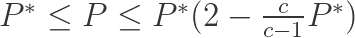

# Deep Insights Into K-nearest Neighbors

#### Introduction

K-nearest neighbors\(in short KNNs\) are a robust yet straightforward supervised machine learning algorithm. Though its regression variant also exists, we’ll only discuss its classification form.

KNN is a _**non-parametric**_ _lazy learning_ algorithm. Let’s have a look at what each term means —

* **Non-parametric**: Unlike the parametric models, the non-parametric models are more flexible. They don’t have any preconceived notions about the number of parameters or the functional form of the hypothesis. They are thus saving us from the trouble of any wrong assumption about the data distribution. For example, in Linear Regression, which is a parametric algorithm, we already have a form of a hypothesis, and during the training phase, we look for its correct coefficient values.
* **Lazy learning**: Also known as _instance-based_ learning. Here the algorithm doesn’t explicitly learn a model, rather chooses to memorize the training set so to be used during the prediction phase. This results in the fast training phase, but expensive testing phase as it requires storing and traversing the whole dataset.

**Intuitive Approach**

The basic idea behind this algorithm is — _**Birds of a feather flock together,**_ i.e., similar things occur nearby, wondering why something like this even holds?  
Well, try imagining a large number of data points in a D dimensional space. It’s not wrong to conclude the subspace will be densely filled, which implies two fairly close points are more likely to have the same label. Indeed there exists a tight error bound on this algorithm —

where P\* is the Bayes error rate, which is the lowest possible error rate for any classifier, c is the number of classes, and P is the error rate of our algorithm. According to the above equation, if the number of points is fairly large, then the error rate of the algorithm is less than twice the Bayes error rate. Pretty cool!  
Don’t get me wrong. By a large number of data points, I don’t mean a large number of features. Rather the algorithm is particularly susceptible to the **curse of dimensionality**, meaning an increase in the dimension\(number of features\) will lead to an increase in the volume of hyperspace required to accumulate a fixed number of neighbors. And as the volume increases, the neighbors become less and less similar because the distance between them increases. Therefore the probability of points having the same label decreases. In those cases, feature selection might come handy.

#### What does KNN do?

The KNN algorithm takes a test input, compares it with every single training example, and predicts the target label as the label that is most often represented in the k most similar training examples. The similarity between two data points is usually measured using Euclidian distance.

When k = 1, the target label is predicted as the label of the nearest training example.  
Since we store and traverse the whole training set for every test example, the testing phase is costly in terms of both memory and time.

#### What is k in kNN?

K is the hyperparameter, whose value controls the learning process. It is the number of neighbors considered for predicting testing examples’ label.

#### Does the value of k affect our classifier?

Before addressing the above question, Let’s understand what we mean by overfitting and Underfitting.  
In supervised learning, we want to build a model that learns from our training set and makes reasonably accurate predictions on unseen data. This ability of our model to _learn enough to apply_ is called generalization.   
Intuitively we expect simple models to generalize better. The complex model [fits the peculiarities of the data, rather than summarising the underlying biology.](https://methodsblog.com/2012/04/23/simple-models-ftw/) They might perform accurately on training data but usually fails to generalize over testing data.   
**Overfitting** occurs when a model fits closely to the peculiarities of the training set but is not able to generalize on new data.  
Whereas Underfitting occurs when a model is too simple and fails even on the training set.

Let’s have a look at what it’s like to consider one nearest neighbor and 20 nearest neighbors —

It can be observed from the above image, k = 1 leads to jagged boundaries, while k = 20 gives us a smooth boundary.   
Smooth boundaries correspond to a simple model, whereas the jagged boundaries correspond to a complex model. Therefore if we keep the value of k low, we risk ourselves of overfitting, while if we keep the value of k high, we risk ourselves of Underfitting.  
So an obvious solution is to keep k such that it’s not too small and not too large. Maybe try evaluating with different values of k and pick what works best.  
Well, this is what we’ll do, but a tad smartly.

#### Validation for Hyperparameter Tuning

As decided earlier, we will try out different values of k but not on the testing set. The testing set should not be used until one time at the very end. Using it before causes us of the trouble of overfitting the testing set and thus unable to generalize on unseen data.   
A way around this is to hold out a subset of the training set for tuning the hyperparameter. This set is called a validation set.  
In case when the training set is small, a more sophisticated technique is cross-validation. Here we split the training set into x groups, say 5. We’ll use 4 of them for training and one for validation. With each iteration, we use another group as a validation set. Finally, the average performance is used for figuring out the best value of k.

![Source: A training and test set is given. The training set is split into folds \(e.g., five-folds here\). The folds 1&#x2013;4 become the training set. One fold \(e.g., fold five here in yellow\) is denoted as the Validation fold and is used to tune the hyperparameters. Cross-validation goes a step further and iterates over the choice of which fold is the validation fold, separately from 1&#x2013;5. This would be referred to as 5-fold cross-validation. In the very end, once the model is trained and all the best hyperparameters were determined, the model is evaluated a single time on the test data \(red\)](.gitbook/assets/image%20%283%29.png)

In the above image, k = 7 results in the lowest validation error.

#### Advantages of KNNs

* KNNs are simple to implement and understand.
* None or very little training time required.
* It works fine with a multiclass dataset.
* KNNs are non-parametric, so it works fine with highly unusual data, as no assumption about the functional form is required.

#### Disadvantages of KNNs

* It has a computationally, expensive testing phase.
* KNN suffers from skewed class distribution. A more frequent class tends to dominate over the voting process.
* KNN also suffers from the curse of dimensionality.

I have tried to give a deep insight into the K-nearest neighbor algorithm.  
I hope everything makes sense.

Thanks for reading!

#### References:

[**CS231n Convolutional Neural Networks for Visual Recognition**  
_Course materials and notes for Stanford class CS231n: Convolutional Neural Networks for Visual Recognition._cs231n.github.io](https://cs231n.github.io/)

[**A Detailed Introduction to K-Nearest Neighbor \(KNN\) Algorithm**  
_K Nearest Neighbor \(KNN from now on\) is one of those algorithms that are very simple to understand but works incredibly…_saravananthirumuruganathan.wordpress.com](https://saravananthirumuruganathan.wordpress.com/2010/05/17/a-detailed-introduction-to-k-nearest-neighbor-knn-algorithm/)

[**A Complete Guide to K-Nearest-Neighbors with Applications in Python and R**  
_This is an in-depth tutorial designed to introduce you to a simple, yet powerful classification algorithm called…_kevinzakka.github.io](https://kevinzakka.github.io/2016/07/13/k-nearest-neighbor/)

